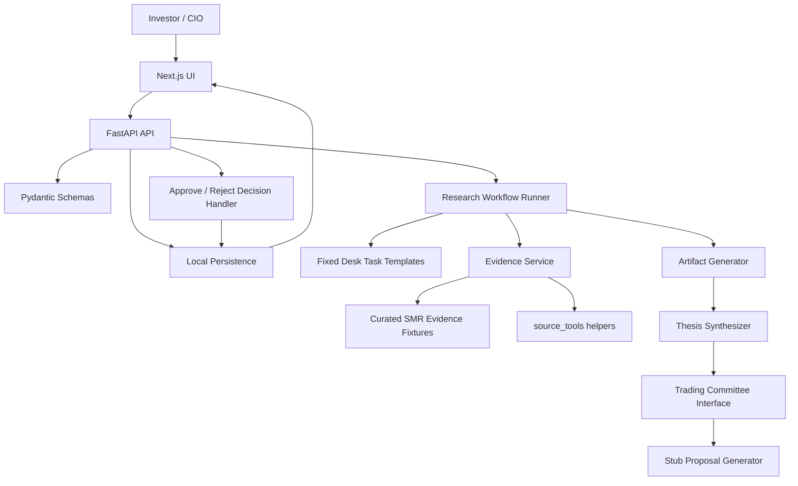
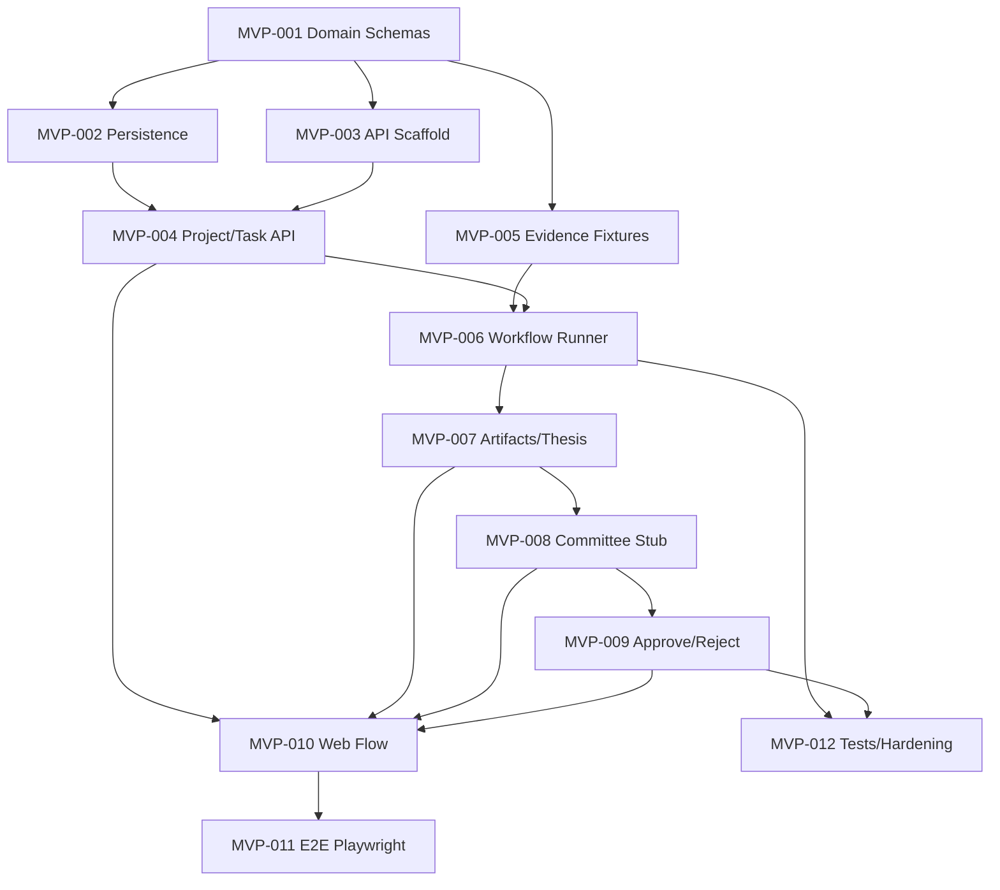

# MVP Technical Requirements

## 1. Technical Summary

The MVP should be implemented as a thin full-stack vertical slice with real domain contracts, simple persistence, deterministic workflow execution, curated evidence, cited artifacts, one thesis, a stubbed Trading Committee boundary, and an approve/reject decision loop.

Recommended runtime boundary:

```text
apps/web -> apps/api -> services/domain workflow -> local persistence
                         -> packages/source-tools where reusable helpers fit
                         -> services/trading-committee stub
```

The MVP must run end-to-end without live network or LLM dependencies. Optional LLM synthesis can be added behind schema-validated interfaces after deterministic fixtures work.

## 2. Current System Assessment

### Existing Architecture

Known from the current repository:

- `apps/api` is an intended FastAPI backend boundary. It currently contains README guidance, not executable app code.
- `apps/web` is an intended Next.js frontend boundary. It currently contains README guidance, not executable app code.
- `services/` contains README-defined service boundaries for ingestion, research orchestration, evidence, thesis registry, and trading committee.
- `packages/domain` and `packages/schemas` are README-defined package boundaries, not implemented packages.
- `source_tools` is imported from `src/source_tools` during development; `pyproject.toml` is configured not to build or install a local `source-tools` wheel.
- `frontend_prototype/投資工作室.dc.html` is a design and workflow reference, not a production dependency.

### Reusable Components

Reusable today:

- `source_tools.rss`: RSS/Atom feed parsing and normalized feed items.
- `source_tools.media`: transcript URL resolution, transcript fetching, audio download, ASR fallback hooks.
- `source_tools.ai`: PydanticAI helper functions for source-grounded summarization, correction, condensation, and chat.
- `source_tools.transcribers`: optional ASR backend wiring.

### Missing Capabilities

The repo does not yet include:

- FastAPI app scaffold.
- Next.js app scaffold.
- Product domain schemas.
- Persistence layer.
- Research workflow runner.
- Evidence store.
- Thesis registry.
- Trading Committee implementation.
- UI workflow screens.
- Product-level tests.

### Technical Limits

- `source_tools` must remain product-agnostic. It must not store Studio workflows, portfolio state, hidden settings, or app-specific prompts.
- TradingAgents must remain behind a Trading Committee boundary if added later.
- The current repository supports planning and reusable source helpers, but not a runnable product app yet.

## 3. Proposed MVP Architecture



### Major Components

- `apps/web`: Thin UI for topic submission, project status, thesis review, proposal review, and approve/reject.
- `apps/api`: API routes, request validation, orchestration entrypoints, and response shaping.
- `packages/schemas`: Shared Pydantic contracts for API, persistence, and agent/workflow IO.
- `packages/domain`: Domain enums and lifecycle rules where useful. Keep simple for MVP.
- `services/research-orchestrator`: Deterministic workflow runner and fixed desk task planner.
- `services/evidence-service`: Evidence fixture loading and citation lookup.
- `services/thesis-registry`: Thesis creation and status persistence.
- `services/trading-committee`: Committee interface plus stubbed proposal generator.
- `packages/source-tools`: Optional helper for RSS/transcript/source-grounded text processing. Product workflows remain outside it.

### Data Flow

1. UI submits topic to API.
2. API validates request and creates project.
3. Workflow runner creates three task records.
4. Evidence service attaches curated SMR evidence records.
5. Artifact generator creates cited artifacts for each task.
6. Thesis synthesizer creates one thesis linked to artifacts and citations.
7. Committee interface creates one proposal from compact thesis context.
8. User approves or rejects proposal.
9. Decision handler persists investment decision.

### Control Flow

MVP can run synchronously or through a simple local workflow command. No background queue is required. Status transitions should still be persisted so the UI can show progress.

### Persistence

MVP persistence can use SQLite or JSON-backed local storage. The data model should stay compatible with future PostgreSQL by using explicit IDs, timestamps, enum strings, and normalized citation references.

### External Dependencies

Required for MVP planning:

- Python 3.13 runtime already declared.
- FastAPI, Pydantic, and frontend dependencies when app scaffolds are added.
- No live LLM, live network, market data, brokerage, or TradingAgents dependency is required for the deterministic demo path.

## 4. Architecture Decisions

### Decision: Use Fixed Desk Templates For MVP

- Rationale: The product needs visible research decomposition, not autonomous agent orchestration.
- Alternatives Considered: Dynamic LLM planner, configurable desks, full multi-agent runtime.
- Trade-offs: Less flexible, but reliable and easy to demo.

### Decision: Use Curated SMR Evidence

- Rationale: Open-ended source discovery would dominate the MVP and reduce repeatability.
- Alternatives Considered: Live web crawling, broad RSS search, user-uploaded arbitrary documents.
- Trade-offs: Narrower evidence coverage, but stronger demo reliability and traceability.

### Decision: Stub Trading Committee Behind Interface

- Rationale: The committee boundary is important, but real TradingAgents integration is not needed to prove the product loop.
- Alternatives Considered: Deep TradingAgents integration, direct proposal generation without boundary.
- Trade-offs: The first proposal engine is not production-grade, but the contract is preserved.

### Decision: Local Persistence Before PostgreSQL

- Rationale: MVP must prove workflow and schemas before infrastructure.
- Alternatives Considered: PostgreSQL from day one, in-memory only.
- Trade-offs: Local persistence is less production-like, but avoids setup cost while still preserving state.

### Decision: Deterministic Fallback Before LLM Generation

- Rationale: Demo and tests must not depend on external LLM availability or variability.
- Alternatives Considered: Live LLM-only research, fully static prototype.
- Trade-offs: Less impressive generation at first, but reliable and testable.

## 5. Functional Requirement Mapping

| Product Requirement | Technical Requirement | Component |
| --- | --- | --- |
| FR-001 | TR-001 | `apps/web`, `apps/api` |
| FR-002 | TR-002 | `apps/api`, persistence |
| FR-003 | TR-003 | research orchestrator |
| FR-004 | TR-004 | research orchestrator, persistence, UI |
| FR-005 | TR-005 | evidence service, schemas |
| FR-006 | TR-006 | artifact generator |
| FR-007 | TR-007 | thesis registry |
| FR-008 | TR-008 | thesis registry, proposal input |
| FR-009 | TR-009 | trading committee service |
| FR-010 | TR-010 | UI, API |
| FR-011 | TR-011 | API decision handler |
| FR-012 | TR-012 | persistence, API |
| FR-013 | TR-013 | fixtures, workflow runner, tests |

## 6. Technical Requirements

### TR-001 - Topic Submission API And UI

- Description: Provide UI and API support for free-form topic submission.
- Related Product Requirement: FR-001
- Implementation Notes: `POST /research-projects` accepts topic and optional priority/facets.
- Dependencies: None.
- Acceptance Criteria:
  - Empty topic returns validation error.
  - Valid topic creates project and returns project ID.
  - UI can submit and navigate to project detail.

### TR-002 - Project Persistence

- Description: Persist research project records.
- Related Product Requirement: FR-002
- Implementation Notes: Use explicit IDs, status enum, created/updated timestamps.
- Dependencies: TR-001.
- Acceptance Criteria:
  - Project can be listed and retrieved by ID.
  - Project survives page refresh and basic backend restart.

### TR-003 - Fixed Task Planner

- Description: Create Industry, Macro/Policy, and Fundamental tasks for each project.
- Related Product Requirement: FR-003
- Implementation Notes: Deterministic template function keyed by project topic.
- Dependencies: TR-002.
- Acceptance Criteria:
  - Three tasks are created for a new project.
  - Tasks reference project ID.
  - No custom desk input is needed.

### TR-004 - Task Status And Activity Events

- Description: Persist and expose task statuses and minimal activity events.
- Related Product Requirement: FR-004
- Implementation Notes: Use simple records, not event sourcing.
- Dependencies: TR-003.
- Acceptance Criteria:
  - UI displays task status.
  - Activity events are timestamped and tied to project/task when relevant.
  - Failed workflow step is visible.

### TR-005 - Evidence And Citation Store

- Description: Store curated evidence records and stable citation IDs.
- Related Product Requirement: FR-005
- Implementation Notes: Fixture loader creates `Evidence` and `EvidenceCitation` records.
- Dependencies: TR-002.
- Acceptance Criteria:
  - Evidence records can be retrieved by ID.
  - Citation IDs resolve to source metadata.
  - Missing citations fail validation.

### TR-006 - Artifact Generation

- Description: Produce one cited artifact per desk task.
- Related Product Requirement: FR-006
- Implementation Notes: Start with deterministic artifacts; optional LLM path must validate schema.
- Dependencies: TR-003, TR-005.
- Acceptance Criteria:
  - Each completed task has one artifact.
  - Each artifact has at least one citation.
  - Artifact validation rejects citation-free output.

### TR-007 - Thesis Synthesis

- Description: Create one thesis from artifacts and evidence.
- Related Product Requirement: FR-007
- Implementation Notes: Thesis stores status and version even if MVP uses one version.
- Dependencies: TR-006.
- Acceptance Criteria:
  - Thesis includes required product fields.
  - Thesis links to artifacts and citations.
  - Thesis is retrievable by project ID.

### TR-008 - Candidate Asset Recommendation

- Description: Store one candidate asset and rationale.
- Related Product Requirement: FR-008
- Implementation Notes: For SMR demo, candidate can be deterministic if rationale cites artifacts.
- Dependencies: TR-007.
- Acceptance Criteria:
  - Candidate appears in thesis or committee input.
  - Rationale references artifacts or evidence.

### TR-009 - Trading Committee Stub

- Description: Provide committee interface and stub proposal generator.
- Related Product Requirement: FR-009
- Implementation Notes: Do not expose TradingAgents internals or depend on TradingAgents.
- Dependencies: TR-007, TR-008.
- Acceptance Criteria:
  - API can request committee evaluation for one thesis/candidate.
  - Proposal follows schema.
  - Proposal links to thesis and citations.

### TR-010 - Proposal Review UI/API

- Description: Expose proposal details for user review.
- Related Product Requirement: FR-010
- Implementation Notes: UI shows status, action, asset, rationale, risks, sizing guidance, and thesis links.
- Dependencies: TR-009.
- Acceptance Criteria:
  - Proposal detail loads by ID.
  - User can navigate between proposal and thesis context.

### TR-011 - Approve/Reject State Transition

- Description: Provide API and UI actions for proposal decision.
- Related Product Requirement: FR-011
- Implementation Notes: Use proposal states `pending_review`, `approved`, `rejected`.
- Dependencies: TR-010.
- Acceptance Criteria:
  - Pending proposal can be approved.
  - Pending proposal can be rejected.
  - Already decided proposal cannot be decided again.

### TR-012 - Investment Decision Record

- Description: Persist final user decision linked to proposal and thesis.
- Related Product Requirement: FR-012
- Implementation Notes: Approval does not create trade or position side effects.
- Dependencies: TR-011.
- Acceptance Criteria:
  - Decision record created on approve/reject.
  - Decision stores proposal ID, thesis ID, status, timestamp, and optional user note.

### TR-013 - Deterministic Demo Fixtures

- Description: Provide seeded SMR evidence and deterministic workflow outputs.
- Related Product Requirement: FR-013
- Implementation Notes: Fixtures should run without network or LLM calls.
- Dependencies: TR-005, TR-006, TR-007, TR-009.
- Acceptance Criteria:
  - Full demo path completes offline.
  - Tests can run without network or LLM keys.

## 7. Interfaces & Contracts

### API Endpoints

Initial API surface:

```text
POST /research-projects
GET /research-projects
GET /research-projects/{project_id}
GET /research-projects/{project_id}/tasks
GET /research-projects/{project_id}/artifacts
GET /research-projects/{project_id}/thesis
POST /research-projects/{project_id}/committee/evaluate
GET /decision-proposals/{proposal_id}
POST /decision-proposals/{proposal_id}/approve
POST /decision-proposals/{proposal_id}/reject
```

Optional if implementation wants explicit workflow control:

```text
POST /research-projects/{project_id}/run-demo-workflow
```

### Agent/Workflow Boundary

Research desks are not runtime agents in MVP. They are task templates with deterministic generation functions:

```text
plan_tasks(project) -> list[ResearchTask]
load_evidence(project) -> list[Evidence]
generate_artifact(task, evidence) -> ResearchArtifact
synthesize_thesis(project, artifacts) -> Thesis
evaluate_committee(thesis, candidate_asset) -> DecisionProposal
```

### Storage Contract

Records use stable string IDs, enum strings, and ISO timestamps. Citation references must be stored as IDs, not copied-only text.

## 8. Data Model

Minimum fields:

- `ResearchProject`: `id`, `title`, `topic`, `objective`, `status`, `created_at`, `updated_at`.
- `ResearchTask`: `id`, `project_id`, `desk`, `title`, `description`, `status`, `created_at`, `updated_at`.
- `Evidence`: `id`, `project_id`, `source_type`, `title`, `url`, `published_at`, `summary`, `metadata`.
- `EvidenceCitation`: `id`, `evidence_id`, `label`, `excerpt`, `location`.
- `ResearchArtifact`: `id`, `project_id`, `task_id`, `title`, `summary`, `findings`, `risks`, `citation_ids`, `created_at`.
- `Thesis`: `id`, `project_id`, `version`, `status`, `claim`, `evidence_for`, `evidence_against`, `assumptions`, `catalysts`, `invalidation_conditions`, `horizon`, `confidence`, `candidate_asset`, `citation_ids`, `artifact_ids`.
- `DecisionProposal`: `id`, `project_id`, `thesis_id`, `asset`, `action`, `status`, `conviction`, `suggested_position_size`, `horizon`, `entry_conditions`, `invalidation_conditions`, `primary_risks`, `rationale`, `citation_ids`.
- `InvestmentDecision`: `id`, `project_id`, `proposal_id`, `thesis_id`, `decision`, `user_note`, `created_at`.
- `ActivityEvent`: `id`, `project_id`, `task_id`, `event_type`, `message`, `created_at`.

## 9. Error Handling

- Validation errors return structured API responses and visible UI messages.
- Missing fixture evidence marks affected task as `failed` or `blocked`.
- Artifact or thesis outputs without citations fail validation.
- Committee generation failure leaves thesis intact and marks proposal step failed.
- Approve/reject on non-pending proposal returns a conflict error.
- Optional LLM failures fall back to deterministic seeded outputs where available.

## 10. Observability

MVP observability should stay minimal:

- Structured backend logs for project creation, task transitions, artifact generation, thesis generation, proposal generation, and decision.
- Activity events visible in UI for meaningful workflow steps.
- No Langfuse, OpenTelemetry, distributed tracing, or production dashboard required.

## 11. Testing Strategy

### Unit Test

- Schema validation for all domain objects.
- Status transition rules.
- Citation resolution and missing citation failure.
- Proposal approve/reject idempotency rules.
- Deterministic fixture loading.

### Integration Test

- Create project through API.
- Generate tasks and attach evidence.
- Generate artifacts, thesis, proposal, and decision using deterministic runner.
- Verify all references resolve.

### End-to-End Demo Test

- Use Playwright against the Next.js UI.
- Submit SMR topic.
- Confirm task statuses, thesis detail, proposal detail, and approve/reject decision.
- Verify the flow runs without live network or LLM dependencies.

## 12. Security Considerations

- MVP stores no brokerage credentials.
- MVP performs no trade execution.
- MVP can assume a single local user.
- If API keys are added for optional LLM use, they must be passed through app configuration and never read implicitly by `source_tools`.
- Fixture data should not include private user data.

## 13. Known Technical Risks

### Risk: LLM Variability Breaks Demo

- Impact: High
- Likelihood: Medium if LLM enabled early
- Mitigation: Build deterministic seeded workflow first; validate LLM output with schemas; keep fallback.

### Risk: Evidence/Citation Traceability Becomes Fake

- Impact: High
- Likelihood: Medium
- Mitigation: Design citation schema before artifact generation; fail validation when citations are missing.

### Risk: Scope Expands Into Agent Platform

- Impact: High
- Likelihood: Medium
- Mitigation: Fixed desk templates only; no autonomous orchestration in MVP.

### Risk: TradingAgents Integration Dominates Timeline

- Impact: High
- Likelihood: Medium
- Mitigation: Stub committee now; integrate TradingAgents later behind same interface.

### Risk: Frontend Becomes Full Dashboard Buildout

- Impact: Medium
- Likelihood: Medium
- Mitigation: Build only workflow screens required for demo.

### Risk: Persistence Choice Causes Rework

- Impact: Medium
- Likelihood: Low
- Mitigation: Use explicit schemas and Postgres-friendly IDs/enums/timestamps even with SQLite or JSON.

## 14. Accepted Technical Debt

- Stubbed committee proposal generator.
- Curated SMR evidence corpus.
- Deterministic task runner instead of durable orchestration.
- Local persistence instead of PostgreSQL.
- Single-user assumption.
- No production auth.
- No background jobs.
- Minimal activity events rather than event sourcing.
- Thin UI instead of complete product shell.
- Optional LLM path behind deterministic fallback.

Refactor triggers:

- Add real TradingAgents only after proposal contract stabilizes.
- Add PostgreSQL when multi-project persistence, retrieval, or deployment requires it.
- Add background jobs when workflows become long-running or parallel.
- Add auth when more than one real user or hosted deployment exists.
- Add richer ingestion only after curated evidence workflow proves useful.

## 15. Development Plan

### Dependency Graph



### Suggested Implementation Order

#### Phase 1 - Foundation

- MVP-001
- MVP-002
- MVP-003

#### Phase 2 - Core Flow

- MVP-004
- MVP-005
- MVP-006
- MVP-007

#### Phase 3 - Decision Loop

- MVP-008
- MVP-009
- MVP-010

#### Phase 4 - Demo Hardening

- MVP-011
- MVP-012

### Critical Path

Critical path for complete demo:

```text
MVP-001 -> MVP-002 -> MVP-004 -> MVP-005 -> MVP-006 -> MVP-007 -> MVP-008 -> MVP-009 -> MVP-010 -> MVP-011
```

### Parallelizable Work

- MVP-003 can proceed after MVP-001 starts.
- MVP-005 can proceed in parallel with API scaffolding once schemas are agreed.
- MVP-010 can begin with mocked API responses after endpoint contracts are stable.
- MVP-012 can add unit tests while UI work proceeds.

## Ticket Requirements

## `MVP-001 - Define Domain And API Schemas`

### Goal

Create Pydantic schemas for MVP domain objects and API payloads.

### Context

Every workflow step depends on stable contracts and citation traceability.

### Scope

- Define schemas for project, task, evidence, citation, artifact, thesis, proposal, decision, and activity event.
- Define enum values for statuses and decisions.
- Add validation rules for required citations.

### Out of Scope

- Database implementation.
- Frontend UI.
- LLM prompts.

### Implementation Notes

Place shared contracts under the intended schemas package or a simple app-local module if package scaffolding is not ready. Keep them easy to move later.

### Dependencies

None.

### Acceptance Criteria

- [ ] Schemas cover all MVP objects.
- [ ] Status enums are explicit.
- [ ] Citation references are modeled as IDs.
- [ ] Invalid citation-free artifacts can be rejected.

### Verification

Run schema unit tests.

## `MVP-002 - Implement Local Persistence`

### Goal

Persist MVP records locally.

### Context

The demo must survive page refresh and basic backend restart.

### Scope

- Implement repository functions for create/list/get/update.
- Support all MVP objects.
- Use SQLite or JSON-backed storage.

### Out of Scope

- PostgreSQL deployment.
- Migrations beyond simple MVP setup.

### Implementation Notes

Prefer explicit IDs and normalized relationships to ease future PostgreSQL migration.

### Dependencies

MVP-001.

### Acceptance Criteria

- [ ] Records can be created and retrieved.
- [ ] Relationships by ID are preserved.
- [ ] Data survives backend restart in local dev.

### Verification

Run persistence integration tests.

## `MVP-003 - Scaffold FastAPI App`

### Goal

Create the backend app entrypoint and route structure.

### Context

The UI and workflow need stable API endpoints.

### Scope

- Add FastAPI app scaffold.
- Add health endpoint.
- Add route modules for projects, committee, and decisions.
- Document backend dev command.

### Out of Scope

- Production deployment.
- Auth.

### Implementation Notes

Keep route handlers thin and delegate workflow work to service functions.

### Dependencies

MVP-001.

### Acceptance Criteria

- [ ] API starts locally.
- [ ] Health endpoint responds.
- [ ] Route structure matches MVP API plan.

### Verification

Run backend smoke test.

## `MVP-004 - Implement Project And Task APIs`

### Goal

Create project and fixed task plan from a submitted topic.

### Context

This is the first user-visible product action.

### Scope

- `POST /research-projects`
- `GET /research-projects`
- `GET /research-projects/{project_id}`
- `GET /research-projects/{project_id}/tasks`
- Fixed Industry, Macro/Policy, Fundamental task creation.

### Out of Scope

- Custom desks.
- Dynamic planning.

### Implementation Notes

Task creation can be synchronous inside project creation.

### Dependencies

MVP-002, MVP-003.

### Acceptance Criteria

- [ ] Valid topic creates project.
- [ ] Project has three tasks.
- [ ] Empty topic is rejected.
- [ ] Tasks are retrievable by project.

### Verification

Run API integration tests.

## `MVP-005 - Build Curated SMR Evidence Fixtures`

### Goal

Create the canonical evidence bundle for the SMR demo.

### Context

Repeatable cited outputs require stable evidence inputs.

### Scope

- Add fixture records for SMR industry, policy, and company candidate research.
- Create citation IDs and excerpts.
- Add fixture loader.

### Out of Scope

- Live source discovery.
- Broad ingestion pipeline.

### Implementation Notes

Fixture records should resemble future persisted evidence shape.

### Dependencies

MVP-001.

### Acceptance Criteria

- [ ] Evidence fixtures load successfully.
- [ ] Every citation ID resolves to evidence.
- [ ] Fixtures cover all three desks.

### Verification

Run fixture and citation tests.

## `MVP-006 - Implement Deterministic Workflow Runner`

### Goal

Run the project through task status transitions and evidence attachment.

### Context

The MVP needs visible progress without background infrastructure.

### Scope

- Start workflow for a project.
- Update task statuses.
- Emit activity events.
- Attach relevant evidence to tasks/project.

### Out of Scope

- Celery, Temporal, or long-running queue.
- Autonomous agents.

### Implementation Notes

A synchronous runner or explicit demo workflow endpoint is acceptable.

### Dependencies

MVP-004, MVP-005.

### Acceptance Criteria

- [ ] Workflow can run for a project.
- [ ] Task statuses change meaningfully.
- [ ] Activity events are persisted.
- [ ] Failure states can be represented.

### Verification

Run workflow integration tests.

## `MVP-007 - Generate Artifacts And Thesis`

### Goal

Create cited artifacts and one thesis from the deterministic workflow.

### Context

This is the core research output.

### Scope

- Generate one artifact per task.
- Generate one thesis per project.
- Link thesis to artifacts and citations.
- Add deterministic seeded outputs.

### Out of Scope

- Multi-thesis comparison.
- Live LLM-only synthesis.

### Implementation Notes

Optional LLM generation can be added after deterministic output validates the contract.

### Dependencies

MVP-006.

### Acceptance Criteria

- [ ] Three artifacts are created.
- [ ] Each artifact has citations.
- [ ] Thesis includes required fields.
- [ ] Thesis references artifacts and citations.

### Verification

Run artifact/thesis unit and integration tests.

## `MVP-008 - Implement Trading Committee Stub`

### Goal

Generate one structured proposal through a committee boundary.

### Context

The product must prove thesis-to-decision escalation without real TradingAgents integration.

### Scope

- Define committee input contract.
- Implement stub proposal generator.
- Add committee evaluation endpoint.
- Link proposal to thesis and citations.

### Out of Scope

- TradingAgents integration.
- Market data.

### Implementation Notes

Keep implementation replaceable behind an interface.

### Dependencies

MVP-007.

### Acceptance Criteria

- [ ] Committee endpoint creates proposal.
- [ ] Proposal includes action, asset, conviction, horizon, sizing guidance, risks, rationale.
- [ ] Proposal links to thesis and citations.

### Verification

Run committee contract tests.

## `MVP-009 - Implement Approve/Reject Decision Flow`

### Goal

Let the user approve or reject a proposal and record the decision.

### Context

This completes the bounded investment decision loop.

### Scope

- Approve endpoint.
- Reject endpoint.
- Decision record creation.
- Proposal status transition.

### Out of Scope

- Trade execution.
- Position creation.

### Implementation Notes

Use conflict response for already decided proposals.

### Dependencies

MVP-008.

### Acceptance Criteria

- [ ] Pending proposal can be approved.
- [ ] Pending proposal can be rejected.
- [ ] Decision record is persisted.
- [ ] Repeat decision attempts are rejected.

### Verification

Run decision state tests.

## `MVP-010 - Build Thin Next.js Workflow UI`

### Goal

Provide the user-facing path through the MVP.

### Context

The product proof requires actual UI workflow, not API-only behavior.

### Scope

- Dashboard-lite/project list.
- Assign topic screen.
- Project detail with tasks and activity.
- Artifact/thesis detail.
- Proposal review.
- Approve/reject controls.

### Out of Scope

- Full portfolio dashboard.
- Polished design system.
- Auth screens.

### Implementation Notes

Use the prototype as workflow reference, not runtime code.

### Dependencies

MVP-004, MVP-007, MVP-008, MVP-009.

### Acceptance Criteria

- [ ] User can submit SMR topic.
- [ ] User can inspect tasks and thesis.
- [ ] User can review proposal.
- [ ] User can approve or reject.

### Verification

Manual UI check and Playwright E2E in MVP-011.

## `MVP-011 - Add Playwright End-To-End Demo Test`

### Goal

Verify the full UI demo path.

### Context

Project instructions require Playwright for frontend workflow verification.

### Scope

- Start app in test mode.
- Submit SMR topic.
- Assert project, tasks, thesis, proposal, and decision states.

### Out of Scope

- Visual regression suite.
- Cross-browser matrix.

### Implementation Notes

Run against deterministic fixtures.

### Dependencies

MVP-010.

### Acceptance Criteria

- [ ] E2E test completes the primary workflow.
- [ ] Test does not require network or LLM.
- [ ] Failure output identifies broken step.

### Verification

Run Playwright test locally.

## `MVP-012 - Hardening, Docs, And Traceability Checks`

### Goal

Close gaps before handoff.

### Context

The MVP must stay traceable from problem to demo.

### Scope

- Add traceability checks for citations.
- Add README command updates.
- Add focused error handling.
- Run lint/tests.

### Out of Scope

- Production deployment docs.
- Observability stack.

### Implementation Notes

Keep documentation concise and command-focused.

### Dependencies

MVP-006, MVP-009, MVP-011.

### Acceptance Criteria

- [ ] Commands are documented.
- [ ] Tests pass.
- [ ] Citation links are checked.
- [ ] Known MVP limitations are documented.

### Verification

Run backend tests, frontend tests, lint, and Playwright workflow.
