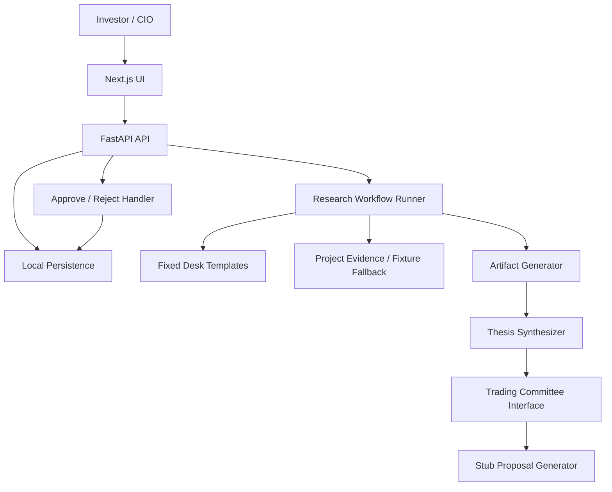

# Architecture

The architecture keeps product research, evidence, thesis lifecycle, and investment decisions separate.

The most important boundary is:

```text
TradingAgents is a Trading Committee engine, not the Research Studio domain model.
```

## Current Runtime

The MVP runtime is a thin full-stack vertical slice:

```text
Next.js UI
  -> FastAPI API
  -> Pydantic schemas and domain rules
  -> deterministic workflow modules
  -> local JSON persistence
```

The deterministic demo path does not require live network calls, LLM calls, market data, brokerage credentials, or TradingAgents.

The attached product context includes possible future service/package layouts and TradingAgents integration options. Those are planning inputs, not current architecture. The repository should stay concrete and small until product behavior requires a split.

## Repository Layout

```text
src/
  studio_api/         FastAPI app, routes, dependencies, local storage
  studio_domain/      domain rules and lifecycle checks
  studio_schemas/     API, persistence, and workflow schemas
  studio_workflows/   deterministic planning, evidence selection, artifacts, thesis, committee stub
  source_tools/       reusable RSS/media/transcript/LLM helpers

frontend/             thin Next.js MVP workflow UI and Playwright tests
frontend_prototype/   design reference only
tests/                focused Python tests
docs/
  product/            product north star, status, roadmap, and evolution plan
  technical/          architecture, API design, and technical records
```

Do not keep empty `apps/`, `packages/`, `services/`, or `vendor/` scaffold directories. Add concrete modules only when implementation needs them.

Do not create a `vendor/tradingagents` tree, separate committee service, or multi-package workspace until the Studio has stable research, thesis, and proposal contracts that justify that boundary.

## High-Level Flow



## Core Components

- `frontend`: topic submission, project status, manual Evidence Workbench, thesis review, proposal review, and approve/reject UI.
- `src/studio_api`: route handlers, request validation, orchestration entrypoints, response shaping, and local persistence access.
- `src/studio_schemas`: Pydantic contracts shared by API, persistence, and workflow code.
- `src/studio_domain`: small domain rules such as proposal decision transitions and project-scoped citation ownership.
- `src/studio_workflows`: deterministic task planning, project evidence selection with curated SMR fixture fallback, artifact generation, thesis synthesis, and committee proposal stub.
- `src/source_tools`: reusable infrastructure for RSS, media/transcript extraction, ASR wiring, and source-grounded LLM helpers.

## Domain Model

Core Studio entities:

- `ResearchProject`
- `ResearchTask`
- `Evidence`
- `EvidenceCitation`
- `ResearchArtifact`
- `Thesis`
- `DecisionProposal`
- `InvestmentDecision`
- `ActivityEvent`

Minimum relationships:

```text
ResearchProject
  has many ResearchTask
  has many Evidence
  has many ResearchArtifact
  has many Thesis

ResearchTask
  belongs to ResearchProject
  outputs ResearchArtifact

ResearchArtifact
  cites Evidence
  may support Thesis

Thesis
  cites Evidence
  derives from ResearchArtifact
  may be sent to Trading Committee

DecisionProposal
  references Thesis
  becomes InvestmentDecision after approve / reject
```

Prototype-aligned future entities should be added only when their lifecycle is real:

- `ThesisVersion`: added when challenge/refinement can create durable revisions.
- `ProposalFeedback`: added when reject/defer/request-more-research feedback needs structured reuse.
- `InvestmentPosition`: added when an approved decision or explicit manual entry becomes a paper position.
- `PositionUpdate`: added when the user can record price, status, partial exit, or thesis-validity changes over time.
- `PortfolioSnapshot`: added when dashboard aggregates need a point-in-time risk/exposure view.

These should extend the lineage chain rather than replace it:

```text
Evidence
  -> ResearchArtifact
  -> Thesis / ThesisVersion
  -> DecisionProposal
  -> InvestmentDecision
  -> InvestmentPosition
  -> PositionUpdate
  -> PortfolioSnapshot
```

## Design Boundaries

Keep these concepts separate:

- `Research != InvestmentDecision`
- `Raw Evidence != ResearchArtifact`
- `Report != Thesis`
- `Role != Runtime Agent Instance`
- `Research Desk != TradingAgents Analyst`
- `Chief of Staff Router != Trading Committee`
- `Deterministic Computation != LLM Reasoning`
- `TradingAgents State != Studio Domain Model`
- `Approval != Trade Execution`
- `Execution Record != Brokerage Order`
- `Position != Portfolio Dashboard`

These boundaries should remain true even after adding real orchestration, richer evidence retrieval, or a real Trading Committee engine.

For prototype-aligned expansion, dashboard screens must aggregate durable records. They should not introduce separate dashboard-only state for proposals, positions, P&L, or research status.

Prototype labels such as "execute" should be implemented as user-entered manual or paper records unless a separate product decision introduces brokerage integration.

## Workflow Boundary

Research desks are product roles and task templates in the MVP, not runtime agents. A future runtime agent may execute a desk task, but the durable Studio record is still the `ResearchTask`, its desk, its status, its blockers, its activity, and its output artifacts.

The Chief of Staff / CIO Router belongs to the Studio workflow boundary. It turns a free-form topic into a project objective, desk-scoped tasks, dependencies, and priority. It should not make investment decisions, own thesis history, or pass raw evidence stores into committee state.

Current workflow functions are intentionally concrete:

```text
route_topic(project_intent) -> ResearchProject
plan_tasks(project) -> list[ResearchTask]
select_project_evidence(project) -> list[Evidence]
generate_artifact(task, evidence) -> ResearchArtifact
synthesize_thesis(project, artifacts) -> Thesis
evaluate_committee(thesis, candidate_asset) -> DecisionProposal
```

The current evidence policy is deliberately simple: cited user evidence wins for its desk, and curated SMR fixtures fill only desks without cited user evidence. Manual evidence entry proves source-grounded traceability before the product adds URL, document, transcript, or RSS ingestion. Evidence review should be introduced as a trust boundary for cited claims and high-impact excerpts, not as the primary product workflow.

Add autonomous planning only after there are enough real task patterns to justify it.

## Trading Committee Boundary

The Trading Committee receives compact research context and returns a proposal. It should not own research projects, evidence storage, thesis lifecycle, or user decision history.

Conceptual input:

```json
{
  "topic": "SMR",
  "asset": "OKLO",
  "thesis_ids": ["thesis-001"],
  "artifact_ids": ["artifact-001", "artifact-002"],
  "evidence_ids": ["ev-001", "ev-002"],
  "portfolio_context": {
    "risk_budget": "medium",
    "existing_positions": []
  }
}
```

Conceptual output:

```json
{
  "action": "WATCH",
  "asset": "OKLO",
  "conviction": 0.68,
  "suggested_position_size": 0.0,
  "horizon": "6-18 months",
  "entry_conditions": [],
  "invalidation_conditions": [],
  "primary_risks": [],
  "supporting_thesis_ids": ["thesis-001"]
}
```

Do not pass the full Evidence Store into graph state. Pass selected IDs and compact summaries.

## `source_tools` Boundary

`source_tools` is useful infrastructure, but it is not the product.

Rules:

- Keep it independent from product auth, UI workflows, portfolio state, watchlists, report persistence, notification channels, and app settings.
- Do not read hidden app settings or `.env` internally. Pass model names, prompts, API keys, DSNs, source metadata, and runtime choices explicitly.
- Preserve source grounding. Keep evidence, inference, uncertainty, named entities, and numbers distinct.
- Keep ASR provider dependencies behind optional extras.
- Import it from local source at `src/source_tools`; do not reintroduce a local wheel build for development.

## Persistence

The MVP uses local JSON persistence for development and demo.

Storage should remain compatible with future PostgreSQL by using:

- stable string IDs
- enum strings
- ISO timestamps
- normalized references by ID
- citation IDs instead of copied-only citation text

Future production persistence should move to PostgreSQL, with FTS and `pgvector` when evidence retrieval becomes real.

## API Design

Current API surface and API rules live in `docs/technical/api.md`.

Keep route handlers thin. Workflow and domain behavior should live in dedicated modules.

## Future Technical Direction

Use boring infrastructure until product behavior requires more:

- Frontend: Next.js.
- Backend API: FastAPI.
- Domain schemas: Pydantic.
- Open-ended research orchestration: evaluate PydanticAI when deterministic fixtures are no longer enough.
- Bounded committee workflow: evaluate LangGraph / TradingAgents behind the existing committee interface.
- Main persistence: PostgreSQL.
- Evidence retrieval: PostgreSQL FTS + `pgvector` + hybrid retrieval / RRF.
- Raw media storage: S3 / MinIO.
- Background jobs: Celery first; Temporal only if workflow complexity justifies it.
- Observability: Langfuse and OpenTelemetry when agent workflows become real.
